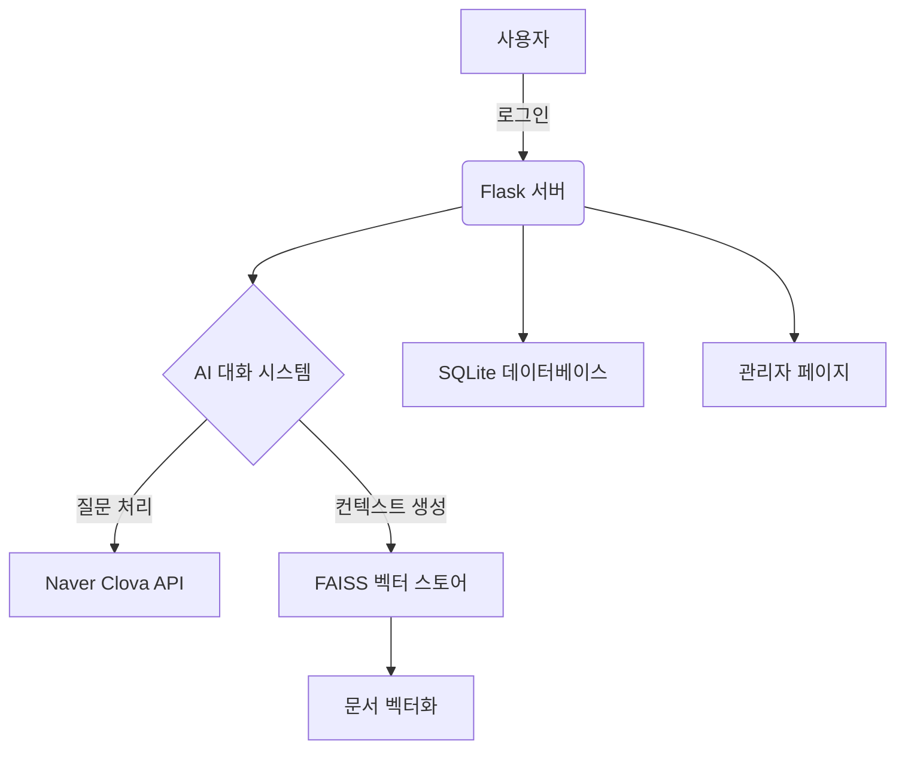

<div align="center">

# GuminAI

### 마크다운 문서 벡터화와 유사도 기반 검색을 통해 답변을 제공하는 Flask 웹 애플리케이션 챗봇


</div>

## 📚 목차
- [개요](#-개요)
- [주요 기능](#-주요-기능)
- [프로젝트 구조](#-프로젝트-구조)
- [설치 및 실행](#-설치-및-실행)
- [환경 설정](#-환경-설정)
- [기여](#-기여)
- [라이선스](#-라이선스)
- [연락처](#-연락처)

## 📖 개요

GuminAI는 다양한 마크다운(Markdown) 문서를 기반으로 사용자의 질문에 정확한 답변을 제공하는 AI 챗봇입니다. 문서를 벡터화하여 유사한 정보를 빠르게 검색하고, Flask를 이용해 손쉽게 웹 애플리케이션으로 배포할 수 있습니다. 초기 설정 과정도 간편하게 구성되어 있어, 별도의 복잡한 절차 없이 바로 서비스를 시작할 수 있습니다.

- **개발 기간**: 2024년 4월 ~ 9월
- **주요 목적**: 문서 기반의 지능형 대화 시스템 구현
- **사용 언어**: Python 3.12.5
- **주요 라이브러리**: Flask, FAISS, SQLite, Naver Clova API, LangChain

## 🌟 주요 기능

1. **💬 모델 생성 및 AI 채팅**
   - **자동 모델 생성**: `/wiki` 폴더의 마크다운 파일을 기반으로 문서 벡터화 및 모델 자동 생성
   - **지능형 대화**: Naver Clova API를 활용한 자연스러운 AI 응답 제공

2. **🔒 사용자 인증**
   - **로그인 시스템**: 비밀번호 기반 안전한 사용자 인증
   - **세션 관리**: 로그인 상태 유지 및 보안 강화

3. **🛠 관리자 기능**
   - **설정 관리**: 애플리케이션 설정 파일 수정
   - **기록 관리**: 대화 내역 조회 및 관리

4. **📚 예시 질문 제공**
   - **랜덤 예시 질문**: 사용자를 위한 다양한 예시 질문 랜덤 제공

## 🏗 프로젝트 구조

GuminAI는 사용자 인터페이스부터 백엔드 서버, AI 응답 생성, 데이터 저장까지 체계적으로 구성되어 있습니다. Flask 서버가 사용자 요청을 처리하고, FAISS를 이용해 벡터화된 문서에서 유사한 정보를 검색하여 Naver Clova API를 통해 지능형 응답을 생성합니다. 모든 대화 내역은 SQLite 데이터베이스에 저장되며, 관리자 페이지를 통해 쉽게 관리할 수 있습니다.

### 기술 스택
- **Backend**: [Python 3.12.5](https://www.python.org/downloads/release/python-3125/)
- **Web Framework**: [Flask](https://flask.palletsprojects.com/)
- **AI API**: [Naver Clova API](https://www.ncloud.com/product/aiService/clovaStudio)
- **벡터 검색**: [FAISS](https://github.com/facebookresearch/faiss)
- **데이터베이스**: [SQLite](https://www.sqlite.org/index.html)
- **문서 처리 및 벡터화**: [LangChain](https://github.com/hwchase17/langchain)

### 주요 모듈
- `app.py`: Flask 애플리케이션의 메인 실행 파일
- `vector_store_manager.py`: 벡터 스토어 관리 및 문서 전처리 로직
- `completion_executor.py`: AI 응답 생성 로직
- `config.yaml`: 애플리케이션 설정 파일
- `setup.bat`: 윈도우용 초기 설정 스크립트
- `setup.sh`: 리눅스/맥용 초기 설정 스크립트

### 작동 구조


## 🚀 설치 및 실행

### 필수 요구사항
- Python 3.12.5 이상
- Git
- [FAISS](https://github.com/facebookresearch/faiss) 설치 (필요 시)

### 설치 과정

#### 1. 저장소 클론
```bash
git clone https://github.com/your-username/guminai.git
cd guminai
```

#### 2. 초기 설정 스크립트 실행

**윈도우**
```batch
setup.bat
```

**리눅스/맥**
```bash
chmod +x setup.sh
./setup.sh
```

#### 3. 필요한 파일 수정
- `example_questions.json`: 예시 질문을 실제 질문으로 수정합니다.
- `model_presets.json`: 모델 설정을 실제 요구사항에 맞게 수정합니다.

#### 4. `/wiki` 폴더 생성 및 마크다운 파일 추가
모델 파일이 없을 경우 자동으로 생성되므로, `/wiki` 폴더를 생성하고 원하는 마크다운 파일을 추가해야 합니다.
```bash
mkdir wiki
# 원하는 .md 파일을 wiki 폴더에 추가
```

#### 5. 가상 환경 설정 (선택사항)

**윈도우**
```batch
python -m venv venv
venv\Scripts\activate
```

**리눅스/맥**
```bash
python -m venv venv
source venv/bin/activate
```

#### 6. 의존성 설치
```bash
pip install -r requirements.txt
```

#### 7. 환경 변수 설정
`.env` 파일을 생성하고 다음 내용을 추가합니다:
```env
# Flask 애플리케이션의 비밀 키
SECRET_KEY=your_secret_key

# 채팅 페이지 접근을 위한 비밀번호
CHAT_PASSWORD=your_chat_password

# 관리자 페이지 접근을 위한 비밀번호
ADMIN_PASSWORD=your_admin_password

# Naver Clova API 키
CLOVA_API_KEY=your_clova_api_key

# Naver Clova API Primary Key
CLOVA_PRIMARY_KEY=your_clova_primary_key

# Naver Clova API Request ID
CLOVA_REQUEST_ID=your_clova_request_id
```

### 실행 방법
```bash
python app.py
```

기본적으로 `http://127.0.0.1:5000/`에서 애플리케이션을 확인할 수 있습니다.

**모델 생성 주의사항**: 모델 파일이 없을 경우, 자동으로 모델이 생성됩니다. 이 과정은 시간이 다소 소요될 수 있으니 참고하시기 바랍니다. `/wiki` 폴더에 필요한 마크다운 파일을 추가한 후 실행하세요.

## 🛠 환경 설정

### `config.yaml` 설정 설명
```yaml
# 벡터 스토어 파일의 경로
vector_store_path: vector_store.index

# 문서 벡터화에 사용할 임베딩 모델 이름
embedding_model_name: jhgan/ko-sroberta-multitask

# 문서 처리 시 사용할 파일 목록 (없으면 폴더 내 모든 .md 파일 사용)
files: None

# 마크다운 파일이 위치한 폴더 경로
folder_path: wiki

# 로그 레벨 설정 (CRITICAL, ERROR, WARNING, INFO, DEBUG)
log_level: CRITICAL


# 생성할 컨텍스트의 최대 총 길이 (문자 수)
max_total_length: 1600

# 유사도 검색 시 가져올 상위 k개의 문서
top_k: 5

# 대화 내역의 최대 길이 (기억력)
max_memory_length: 10

# alpha 값은 문서 가중치 조정 파라미터
alpha: 1
```

## 🤝 기여
1. 이 저장소를 포크합니다.
2. 새 브랜치를 생성합니다: `git checkout -b feature/AmazingFeature`
3. 변경사항을 커밋합니다: `git commit -m 'Add some AmazingFeature'`
4. 브랜치에 푸시합니다: `git push origin feature/AmazingFeature`
5. Pull Request를 생성합니다.

## 📄 라이선스
이 프로젝트는 MIT 라이선스 하에 배포됩니다. 자세한 내용은 `LICENSE` 파일을 참조하세요.

<div align="center">

[](LICENSE)

</div>

## 📢 연락처
- **이메일**: your-email@example.com
- **GitHub**: [your-username](https://github.com/your-username)
